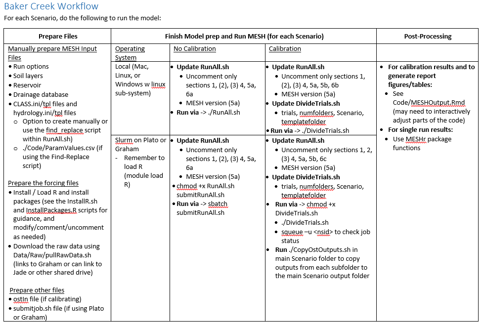

# Representation of Spatial Heterogeneity in the MESH Model - Baker Creek, NWT

## Team
  **Primary modeller:** Haley Brauner  
  **MESH training and support:** Dan Princz, ECCC  
  **Advisors:** Bruce Davison, ECCC and Andrew Ireson, GIWS  

## Date
November, 2019

## Purpose
  This project was completed as the Capstone Project for the Masters of Water Security (MWS) program at the University of Saskatchewan in partnership with Environment and Climate Change Canada (ECCC) between May-August, 2019. The project replicated the methodology of a project conducted in the White Gull Creek watershed (SK) in 2017 by a previous MWS student, Herbert Mkandla, and aimed to explore the effects of various representations of sub-grid spatial heterogeneity on model performance. The project also compared the WATROF and PDMROF algorithms.

  The November update corrected gaps and duplicates in the driving data, and ran the calibrations for each scenario again with the same methodology and MESH code versions as the original project.

## Progress / Conclusion
  The modelling project for the purpose of the MWS Capstone Project is complete, though more work could be done to the model of the Baker Creek watershed to get better performance results.

## References
  See the [Basin Meta-data Page](https://wiki.usask.ca/display/MESH/Basin+Meta-data) and the project report for a list of references. *Not yet complete*
___

# Workflow Procedure
In order to reproduce the project workflow, the following steps can be followed:

Notes:
-	The method of dividing trials was used to reduce total computational time for running Ostrich in serial; If Ostrich can be set up to run in parallel, this would negate the need for the trial division and the workflow would change.
-	When testing the “Calibration” scenarios, keep the number of iterations low (i.e. <5 or 10, see ostIn.txt) and the number of trials and folders low (ie. <5, in DivideTrials.sh)

___
# Folder Structure
Giving the file size limitations of GitHub, only smaller files are stored here and the rest are stored on Graham. The files can be synced with the local machine via the respective push/pull bash scripts included in the Data/Raw and Model folders.

Fore reference, the general rule for file sizes on GitHub is:
- Repositories should be < 1 GB
- Files must be < 100 MB

## Code
- Includes pre- and post-processing scripts used in the project

## Data

### Raw
- Includes data downloaded from ECCC using R, ESSD data (Spence & Hedstrom, 2018), GEM and CaPA data, and WSC streamflow (downloaded manually, though this should be done with an R script)

### Processed
- Includes processed driving data, spatial data (for use in Green Kenue to generate the r2c file for Scenario 3), and streamflow data used for validation

#### Driving
- Processed driving data used in the model
  - One set used for Scenario 1
  - One set used for Scenarios 2 and 3
    - Note: this is the same data as Scenario 1, but copied to 6 columns -> one per GRU
- Scripts used to generate the Scenario 1 file are included in the "Code" folder

#### Spatial
- Green Kenue files used to generate the r2c file for Scenario 3

#### Validation
- Streamflow data, including the full period, calibration period (all other values set as negative), and validation period (all other values set as negative)

## Model
*Includes "MESH Modelling Journal.docx", which is notes kept during the modelling.  
Also includes a "ReadMe.md" file which describes the differences between the model scenarios.*

### Justification
- Include an Excel (xlsx) file outlining the parameters and ranges used in the model and rationale for their use (with references listed).
- Also includes the equation used in scaling wind observations from near-surface to reference height (which was 40m)

### MESH_Code
- Holds the MESH code used for running the mode
  - MESH_Code.r1024 was used for Scenarios 1, 2, and 3 of the modelling project
  - r1552_mod was used for Scenarios 1-P and 2-P
  - No modifications were made to the code

### Ostrich
- This folder contains a copy of the Ostrich program (uncompiled).

### Scenario_*
*1 folder for each configuration, each with input and output sub-folders*

- Input  
  - *Includes the MESH inputs files, driving data, and scripts for the model configuration*

- Output
  - *Includes the output files for the model configuration / each run*

## Presentations
*Contains the final powerpoint presenation and the draft project report (final pdf yet to be released)*

## Site
Includes:
- Maps
- PhotosVideos
- Site Meta-data
